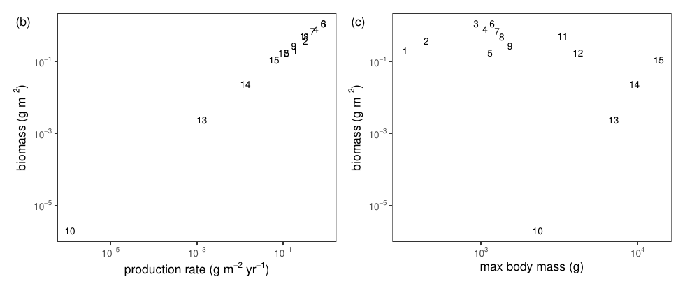
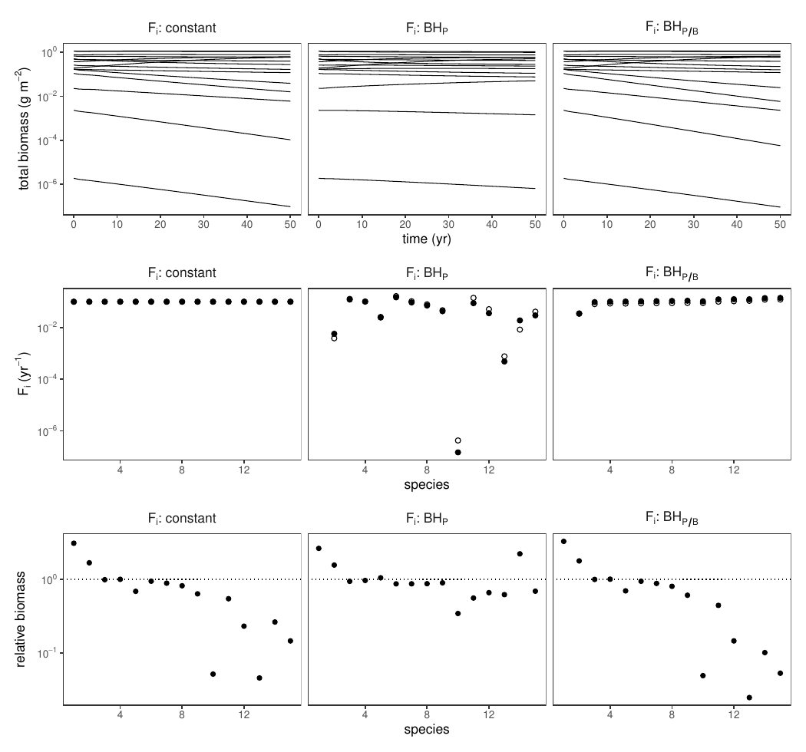
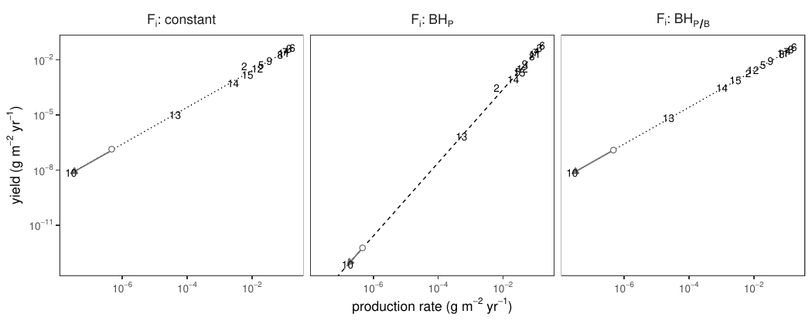
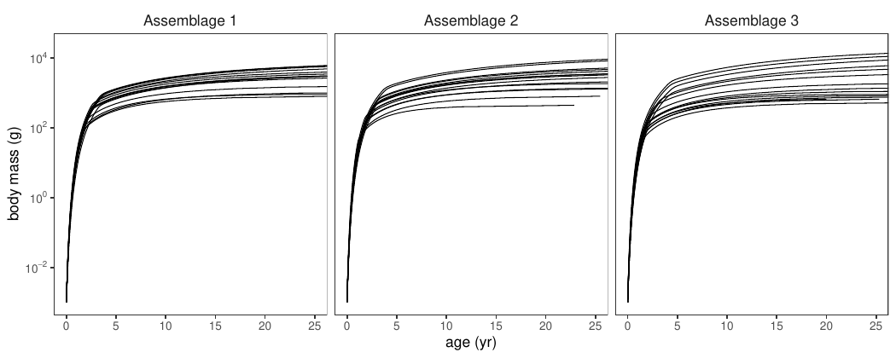
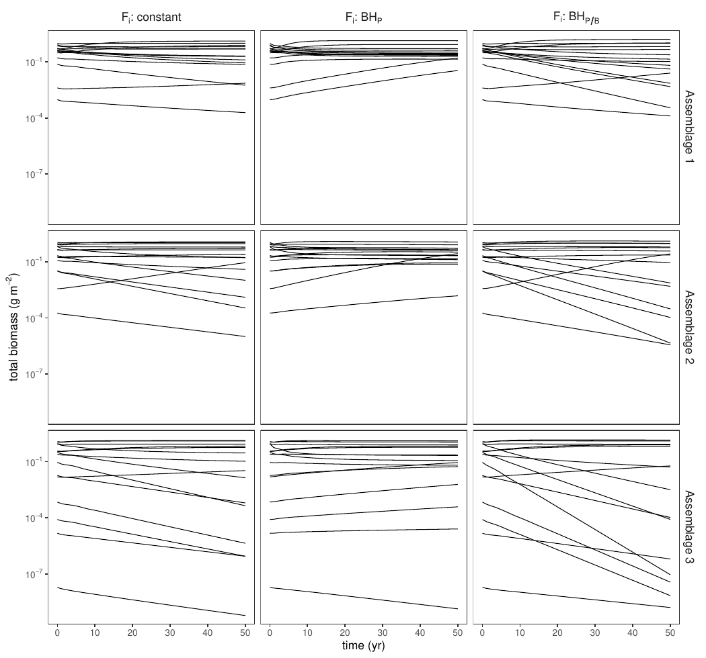

A reimplementation in [mizer](https://sizespectrum.org/mizer/) of

> Law, R. & Plank, M.J. (2023) *Fishing for biodiversity by balanced harvesting.*
> **Fish and Fisheries** 24, 1–17.
> doi:[10.1111/faf.12705](https://doi.org/10.1111/faf.12705)
> (preprint: doi:[10.1101/2021.06.27.450047](https://doi.org/10.1101/2021.06.27.450047))

Source: [github.com/gustavdelius/balanced-harvest](https://github.com/gustavdelius/balanced-harvest)

---

## The question

Can fishing, if scaled sensibly across species, help maintain biodiversity
rather than erode it? Law & Plank compare three ways of setting the fishing
mortality rate of species *i*:

| | rule | |
|---|---|---|
| fixed | `F_i(t) = F` | Eq. (2.7) |
| BH<sub>P</sub> | `F_i(t) = c_P · P_i(t)` | Eq. (2.8) |
| BH<sub>P/B</sub> | `F_i(t) = c_P/B · P_i(t)/B_i(t)` | Eq. (2.9) |

Every fish enters a single mixed-species fishery at `w_f = 400 g`, and
everything above that is caught at the same rate, so `F` is size-independent and
the balancing is **across species, not across sizes**. `B_i` and `P_i` are
measured over that same harvested range. `c_P/B` is simply a fixed exploitation
ratio `E = Y_i/P_i` applied to every species.

The argument is that because biomass and production rate are tightly coupled
across species (`B_i ~ P_i^α` with α near 1), setting `F_i ∝ P_i` makes fishing
mortality roughly proportional to biomass — so it falls away as a stock falls.
Fixed `F` has no such feedback, and `P_i/B_i` barely changes as a stock thins,
so BH<sub>P/B</sub> has almost none either.

## Is this really the paper's model?

The paper's model is **not** a standard mizer model. It has no satiation and no
metabolic cost, no imposed stock-recruitment relationship, food-dependent
intrinsic mortality, logistic plankton with immigration instead of a
semichemostat resource, and a box feeding kernel spanning four decades of prey
size. All of that is built from Appendices A–C; the term-by-term correspondence
is in [mapping.md](mapping.md).

Rather than assert the mapping, [`tests/test_model.R`](https://github.com/gustavdelius/balanced-harvest/blob/main/tests/test_model.R)
checks mizer's rates against hand-coded integrations of the paper's own
equations on the model's own grid. All sixteen checks pass — the encounter rate
against Eq. (A.2) and predation mortality against Eq. (A.3) agree to about
1e-13, and the production integral of Eq. (2.4), including its boundary terms,
converges at the expected first order.

Three independent quantities then came out close to the paper's without being
fitted to them:

| | this reimplementation | Law & Plank |
|---|---|---|
| α in `B ~ P^α` (four ecosystems) | **0.977, 0.998, 0.993, 0.984** | 1.004 |
| `c_P` calibrated against `F = 0.1` | **0.906** m² g⁻¹ | 1 |
| `c_P/B` calibrated against `F = 0.1` | **0.259** | 0.25 |

α matters most: it is the exponent the whole Figure 4 argument rests on
("species were near a line of slope 1 + α = 2.004"), it is set by how much
adult mortality the model has, and it emerges here from four independently
assembled ecosystems.

## The ecosystems

Following Appendix B, each ecosystem is assembled by introducing one fish
species at a time — random maximum body mass (log-uniform, 100 g to 40 kg) and
random larval death rate — letting the system relax for 50 years, and culling
anything below 2×10⁻⁶ g m⁻², until 15 species coexist.

| | eco1 | eco_r1 | eco_r2 | eco_r3 | paper |
|---|---|---|---|---|---|
| species | 15 | 15 | 15 | 15 | 15 |
| invasion attempts | 23 | 25 | 30 | 33 | 25, 24, 19, 45 |
| `w_max` range | 327 g – 13.6 kg | 860 g – 9.3 kg | 459 g – 14.5 kg | 566 g – 22.3 kg | 100 g – 40 kg |
| biomass span | 5.8 decades | 3.0 | 3.8 | 7.8 | ~4 |
| cor(log B, log P) | 0.999 | 0.998 | 0.997 | 1.000 | — |
| primary production (g m⁻² yr⁻¹) | 4310 | 4332 | 4324 | 4312 | ~4000 |
| total fish biomass (g m⁻²) | 5.95 | 6.24 | 5.82 | 5.51 | ~4–5 |
| yield at `F = 0.1` (g m⁻² yr⁻¹) | 0.287 | 0.503 | 0.416 | 0.289 | ~0.25 |
| Fogarty ratio (‰) | 0.067 | 0.116 | 0.096 | 0.067 | 0.06 |

The paper does not report its random seed or the realised life histories of its
15 species, so this reproduces the assembly *procedure*, not the particular
assemblage. The figures below are therefore comparable in kind, not number for
number.

---

## Figure 2 — the biomass–production relationship



Panel (b) is the relationship the whole argument depends on: biomass and
production rate are tightly correlated across species, over six decades. Panel
(c) shows the pattern the paper reports in its own Fig. 2c — the small-`w_max`
species are the common ones, and the rare species sit at larger maximum body
mass.

(The paper's Fig. 2a is a scatter from an Ecopath model of the West Scotland
shelf. That is empirical data, not model output, and is not reproduced here.)

## Figure 3 — three ways to harvest the same assemblage



All three regimes are calibrated to the same total yield after 50 years
(0.197–0.198 g m⁻² yr⁻¹).

**Top row**, total biomass of each species over the 50 years of fishing. Under
fixed `F` and BH<sub>P/B</sub> several species fall along straight lines in log
biomass — exponential decline. Under BH<sub>P</sub> the trajectories are
comparatively flat.

**Middle row** is the mechanism, laid bare. Fixed `F` is flat across species by
construction. BH<sub>P/B</sub> is *also nearly flat* — which is the paper's
point: `P_i/B_i` is much the same for every species, so a constant exploitation
ratio is barely distinguishable from a constant `F`. BH<sub>P</sub> spans seven
orders of magnitude, dropping to `F ≈ 10⁻⁷ yr⁻¹` for the rarest species.

**Bottom row**, the ratio of year-50 to year-0 biomass. Under fixed `F` and
BH<sub>P/B</sub> the larger-numbered (rarer) species fall well below the dotted
line; under BH<sub>P</sub> they stay close to it.

## Figure 4 — yield against production rate



Dotted lines are isoclines of constant exploitation ratio `E`; the dashed line
in the middle panel has slope 1 + α.

Under fixed `F` and BH<sub>P/B</sub> the species lie along a line of slope 1 —
every species is exploited at the same ratio, regardless of how rare it is. That
is what puts the rare ones on a downward path. Under BH<sub>P</sub> the species
lie along the steeper slope-(1+α) line: yield rises faster than linearly with
production, so rare species are exploited at a progressively *smaller* fraction
of their production. The open circle and arrow trace the rarest fished species
from year 0 to year 50.

This is the paper's central quantitative claim, and it reproduces.

## Figure 5 — emergent growth



Growth trajectories obtained by integrating Eq. (C.1). Nothing here is imposed:
body growth emerges from what the fish actually eat. By age 1 the species span a
3.3- to 3.7-fold range in body mass, against the 4- to 7-fold range the paper
reports for its own assemblages.

## Figure 6 — three more ecosystems, harder fishing



Three independently assembled ecosystems (rows) with extra life-history
variation, baseline fishing doubled to 0.2 yr⁻¹, and a random per-species
intensity factor `z' ~ U(0.5, 1.5)` applied identically to all three rules. The
BH<sub>P</sub> column is visibly flatter than either neighbour in all three
assemblages, and the BH<sub>P/B</sub> collapses in assemblage 3 are dramatic.

---

## The headline comparison

On `eco1`, with all three regimes calibrated to the same total yield:

| regime | yield (g m⁻² yr⁻¹) | worst species, vs year 0 | worst species, vs unfished control | species below 10% of control |
|---|---|---|---|---|
| unfished control | 0 | 0.174 | 1.00 | 0 |
| fixed *F* | 0.198 | 0.046 | 0.166 | 0 |
| **BH<sub>P</sub>** | **0.198** | **0.345** | **0.573** | **0** |
| BH<sub>P/B</sub> | 0.197 | 0.025 | 0.070 | 3 |

Across all four ecosystems, counting species that end below 10% and below 1% of
what they would have been with no fishing at all:

| | eco1 | eco_r1 | eco_r2 | eco_r3 |
|---|---|---|---|---|
| fixed *F* | 0 / 0 | 0 / 0 | 3 / 0 | 5 / 2 |
| **BH<sub>P</sub>** | **0 / 0** | **0 / 0** | **0 / 0** | **0 / 0** |
| BH<sub>P/B</sub> | 3 / 0 | 3 / 1 | 6 / 3 | 6 / 6 |

BH<sub>P</sub> does not push a single species below 10% of its unfished
trajectory in any of the four ecosystems, and its worst-affected species retains
25–57% of unfished biomass. In the three Figure 6 ecosystems it does this while
returning *more* yield than fixed `F` (0.797 vs 0.631, 0.539 vs 0.422, 0.369 vs
0.344), so it is not buying protection by fishing less.

**The paper's conclusion reproduces.**

## One correction to how the comparison is framed

Law & Plank compare year-50 fished biomass against year-0 unfished biomass. But
the assembled ecosystem is explicitly only a quasi-equilibrium — the paper says
so — and it drifts. In the unfished control run here, the worst-affected species
still falls to **17% of its year-0 biomass over 50 years with no fishing at
all**, and individual species move by 39–86% over a further 20 unfished years.

Comparing against year 0 therefore charges fishing for drift it did not cause.
The effect is not small: fixed `F` on `eco1` looks like it takes its worst
species to 4.6% of where it started, but only to 17% of where it would have been
anyway, and the count of species below 10% falls from 2 to 0 once the control is
used. The ranking of the three rules is unchanged, but the magnitudes are not.
Both columns are reported above.

## Where this departs from the paper

Two places in the paper needed a judgement call, and one of them matters a great
deal. Full detail in [mapping.md](mapping.md) and [mu_b.md](mu_b.md).

**Eq. (A.7) contradicts itself.** The prose says background mortality is
proportional to metabolic need *divided by* the rate food becomes available; the
printed formula *multiplies* by it. The two differ by two orders of magnitude in
adult mortality. The printed version gives near-zero adult mortality, biomass
piling up at `w_max`, roughly ten times too much fish biomass, and large species
so dominant that small ones cannot invade at all. The prose version reproduces
the paper's own reported biomass range, its 0.25 g m⁻² yr⁻¹ yield, its 0.06 ‰
Fogarty ratio, and its ordering in which small species are common and large ones
rare. This implementation follows the prose; `mu_b_form = "product"` gives the
other.

Three smaller ones: Eq. (A.3) as printed evaluates the predator's search area at
the *prey's* body mass (Eq. A.2 uses the consumer's own size, so this is a typo);
Table 1 contradicts the text on the plankton carrying-capacity offset (the text
is right, and gives the stated 4000 g m⁻² yr⁻¹ of primary production); and
Appendix B does not say what power law an invading spectrum starts on.

## Is the result robust?

Reproducing a result is not the same as testing it.
[robustness.md](robustness.md) works through which of the paper's arbitrary
choices could change the conclusion — the year-50 yield-matching criterion, the
absence of compensatory recruitment, whether `F ∝ B` would do just as well as
`F ∝ P`, and whether the *adaptive feedback* or merely the *initial allocation*
is doing the work — and sets out an investigation.

One finding from that work is already in hand. Appendix B nominates competition
among larvae for plankton as the mechanism that replaces an imposed
stock-recruitment relationship. Measured on the assembled 15-species ecosystem,
the plankton over the entire larval prey range (10⁻⁸ to 10⁻⁴ g) sits **at its
carrying capacity**, and doubling the whole fish spectrum changes growth at egg
size by only −1.3% (against −91% at 100 g). The reason is structural: the paper
sets immigration `I₀` equal to carrying capacity `a₀` with the same size
scaling, so `I/a = 1 per year at every plankton size`, while plankton at larval
prey sizes regenerate at 40–220 yr⁻¹. The model therefore has neither an imposed
recruitment brake nor, at these parameter values, the emergent one offered in
its place.

## Reproducing this

```bash
Rscript tests/test_model.R        # verify the mapping; needs no inputs
Rscript run_assembly.R            # ~1 h  -> data/ecosystems.rds
Rscript tests/test_ecosystem.R    # check the ecosystems against Appendix B
Rscript run_figures.R             # ~40 m -> data/results.rds, figures/
Rscript tests/test_convergence.R  # the numerical liberties taken
```

Requires [mizer](https://sizespectrum.org/mizer/) (developed against 3.3.0.9000),
ggplot2 and patchwork.

## A second test, on a real ecosystem

The ecosystems above are assembled inside the model, which is the right way to
test the paper but says nothing about whether the result survives contact with a
real one. [north-sea.md](north-sea.md) runs the same three rules on mizer's
North Sea model with real depleted species — thornback ray and Atlantic halibut
— added at abundances estimated from ICES IBTS survey data.

The conclusion holds there too, but conditionally: `NS_params` as it ships has
nothing capable of being lost, and BH<sub>P</sub> looks *worst* of the three
until something at risk is put in. Halibut then goes from 2% of its unfished
trajectory under a constant `F` to 540% under BH<sub>P</sub>, at equal yield,
while BH<sub>P/B</sub> destroys the thornback ray.

## Caveats

The ecosystems are not the paper's ecosystems — the assembly procedure is
reproduced, not the particular assemblage, because the seed and realised life
histories are not reported. Four ecosystems is a small sample for a claim about
assemblages in general. And the comparison rests on a single calibration
criterion; the trade-off frontier proposed in [robustness.md](robustness.md)
would be a stronger design than the one used here and in the paper.
