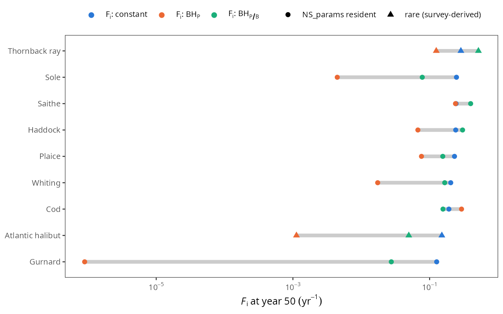
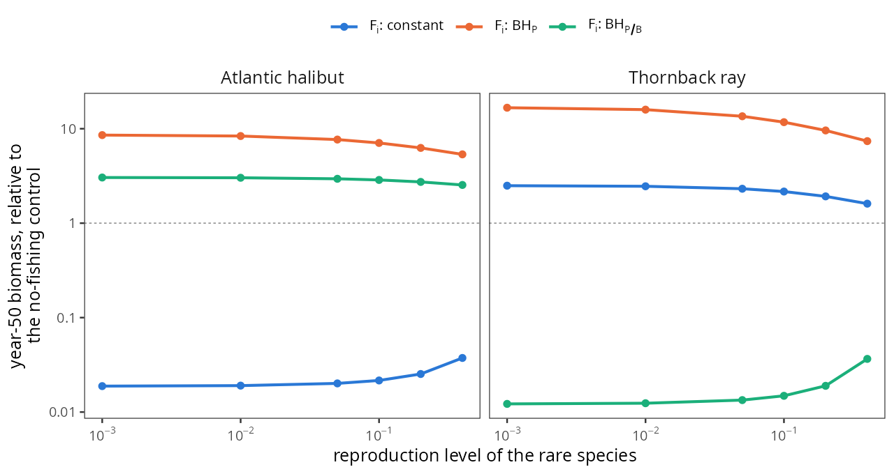
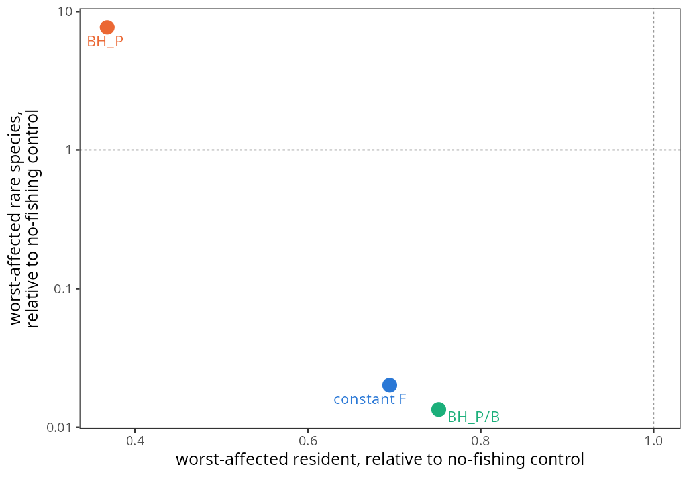

# Does balanced harvesting still help in a real, calibrated ecosystem?

The [main reimplementation](index.md) tests Law & Plank (2023) the way the paper
does it: on ecosystems assembled from scratch inside the model, following the
paper's own Appendix B procedure. On those, the paper's conclusion reproduces —
BH<sub>P</sub> does not push a single species below 10% of its unfished
trajectory, while fixed `F` and BH<sub>P/B</sub> do.

That is the right test of the paper. It is not a test of whether the result
survives contact with a real ecosystem, and the two can come apart for a reason
worth taking seriously: an assembled ecosystem contains rare species *because
the assembly procedure produced them*, with life histories drawn at random. A
real one contains particular rare species, with particular life histories, at
particular abundances that somebody has measured.

This page runs the same three rules on mizer's North Sea model, `NS_params`,
first as it ships and then with real depleted North Sea species added at
survey-derived abundances. The short answer is that **the paper's conclusion
holds, but only once the ecosystem actually contains something at risk** — and
that the diagnostic usually reached for ("which species is most depleted?")
points the wrong way.

---

## Part 1 — `NS_params` as it ships: BH<sub>P</sub> buys nothing

`NS_params` is twelve North Sea stocks, calibrated to observations, and it
ships fished (effort 0.5–1.0 across its four gears). Setting the three rules up
on it is straightforward: a knife edge at `w_f = 400 g` shared by all species,
one gear per species so each can carry its own rate, and the rules themselves as
a custom `FMort` (see [Implementation](#implementation) below).

Calibrated to equal total yield over 50 years, the outcome is flat:

| regime | worst-affected of the twelve |
|---|---|
| fixed `F` | 0.694 |
| **BH<sub>P</sub>** | **0.351** |
| BH<sub>P/B</sub> | 0.751 |

BH<sub>P</sub> is the *worst* of the three on the conventional most-depleted
test. That is not a failure of the rule; it is a property of the ecosystem it
was given. Two things drive it:

**Nothing in `NS_params` is at risk.** Its `reproduction_level` is 0.99–1.00 for
almost every species — recruitment pinned at `R_max`, unable to respond to
spawner abundance at all. In a run of these scenarios every recruitment ratio
came out at exactly 1.000. A model in which no stock can fail is a model in
which a rule designed to stop stocks failing has nothing to do.

**The most-depleted species is the most productive one.** BH<sub>P</sub> sets
`F ∝ P`, so it concentrates fishing on whatever produces most — here Cod. The
"worst-affected species" statistic therefore tracks the species BH<sub>P</sub>
*intends* to fish hardest, and reports the rule's design as a defect. Any
summary that takes a minimum across species will do this.

So the first finding is methodological rather than ecological: **the standard
depletion diagnostic is not a test of balanced harvesting.** It answers a
different question from the one the paper asks.

---

## Part 2 — putting real rare species in

The North Sea's genuinely depleted large species are elasmobranchs, plus
Atlantic halibut among teleosts. Four candidates went in: thornback ray
(*Raja clavata*), spurdog (*Squalus acanthias*), common skate (*Dipturus
batis*) and Atlantic halibut (*Hippoglossus hippoglossus*). All are caught as
bycatch by a mixed demersal fishery above 400 g, all grow slowly, and all mature
late.

Life-history parameters come from FishBase via `rfishbase`, taking the median
across studies:

| | `w_max` | `w_mat` | `k_vb` | studies (growth / maturity) |
|---|---|---|---|---|
| Thornback ray | 11.1 kg | 2.2 kg | 0.124 | 20 / 17 |
| Spurdog | 7.0 kg | 1.9 kg | 0.080 | 37 / 17 |
| Common skate | 164 kg | 27.3 kg | 0.057 | 1 / 2 |
| Atlantic halibut | 130 kg | 13.4 kg | 0.061 | 8 / 4 |

For comparison the twelve residents have `k_vb` 0.12–1.00, median 0.30. The rare
species are two to five times slower.

### The interaction matrix is not a detail

`addSpecies()` defaults every interaction involving a new species to 1, in both
directions. In `NS_params` that is far outside the fitted range: the residents'
off-diagonal coefficients have median 0.24 and maximum 0.565, with 97% below
0.5. The matrix is a spatial-overlap matrix and it is structured — Sole↔Saithe
is 0.01, a shallow flatfish against a deep roamer; Cod↔Cod is 0.79.

Taking the default means the new species eat, and are eaten by, all twelve
residents more strongly than any fitted pair in the model. It is not a mild
assumption, and on this model it decides the answer entirely:

| interaction | Thornback ray | Spurdog | Common skate | Halibut |
|---|---|---|---|---|
| 1.0 (the default) | 3×10⁷ | 8×10¹⁶ | 2×10⁸ | 1×10⁶ |
| 0.565 (resident max) | 170 | 2×10⁹ | 460 | 10 |
| 0.239 (resident median) | 0.002 | 36 | 0.001 | 0.0002 |

Those are the reproductive efficiencies `erepro` the species would need. Values
above 1 mean more egg biomass than the energy allocated to producing it — not a
tuning inconvenience but a physical impossibility, and mizer says so. At the
default the species are not merely fragile, they are unrepresentable; two steps
down they are comfortable. Everything in between is invisible if you never look.

Rather than pick a constant, each new species inherits the overlap *profile* of
the resident it most resembles, which reuses the fitted structure instead of
inventing a number:

| new species | analogue | rationale |
|---|---|---|
| Thornback ray | Gurnard | benthic feeder, medium demersal |
| Spurdog | Whiting | mobile mid-water piscivore |
| Common skate | Cod | large demersal predator |
| Atlantic halibut | Saithe | large, deeper water |

The profiles come out sensible without further tuning: halibut barely overlaps
sprat (0.02) while skate overlaps nearly everything. At this matrix, unscaled,
three of the four species are viable — ray 0.005, skate 0.26, halibut 0.013 —
and only spurdog is not.

### How rare is rare? Swept-area biomass from the IBTS

Abundance is the other half, and it cannot be guessed: BH<sub>P</sub> sets
`F ∝ P ∝ B`, so how rare a species actually is determines directly how much
protection the rule appears to give it. `addSpecies()` places new species at
whatever is convenient — at most 1/100 of the resource power law — which is an
initial condition, not an observation.

Estimates here come from the ICES North Sea IBTS, quarter 1, 2015–2019: 1831
valid hauls, catch converted to mass through FishBase length–weight parameters,
divided by the area each net actually fished (tow distance × wing spread, median
19.9 m, matching the GOV trawl's design), and raised to the 570,000 km² of ICES
Subarea 4. Total swept area is 124 km², or 0.022% of the North Sea.

The method validates on a species whose stock size is known independently:
**cod comes out at 136,000 t**, against ICES' roughly 100–150 kt for that
period.

| | swept-area | on `NS_params`' scale |
|---|---|---|
| Thornback ray | 7,890 t | 34,800 t |
| Spurdog | 5,020 t | 22,200 t |
| Atlantic halibut | 692 t | 3,050 t |
| Common skate | 567 t | 2,500 t |

`NS_params` sits 4.41× above the swept-area estimate for cod, so the second
column puts the observations on the model's own scale. Matching to them moves
the rare species by **15–40×** from where `addSpecies()` had parked them: they
were far rarer than reality, which would have flattered BH<sub>P</sub>
considerably.

An earlier attempt scaled them relative to resident species instead and is worth
recording as a dead end. It gave estimates spanning four orders of magnitude
depending on which resident was chosen — because `NS_params` has Dab at 10.6 kt
and Gurnard at 62 kt, while the survey catches 660× more dab than gurnard. The
model's relative abundances among its minor species do not match the survey, so
anchoring to them inherits that.

### Two species drop out, and one of them is a result

**Spurdog** cannot be represented at all. It is viviparous, bearing a few ~60 g
pups after one of the longest gestations of any vertebrate, and mizer's
per-species egg size `w_min` is the parameter for that. `addSpecies()` rejects
any `w_min` above the model's grid minimum — see
[the bug](#a-mizer-bug-found-along-the-way) — so spurdog would have to run the
entire larval gauntlet from 1 mg, which it cannot.

**Common skate** needs `erepro` 29 at its observed 2,500 t. The model is saying
that the North Sea common skate population cannot be sustained by its own
reproduction. That is not obviously wrong. The survey caught 22 individuals in
1831 hauls, every one between 69 and 115 cm, and the species matures at 145 cm —
not a single mature animal in five years of sampling. A remnant sustained by
immigration, if it is sustained at all, is exactly what fails this test.

That leaves thornback ray and Atlantic halibut, both viable at their observed
abundances (`erepro` 0.645 and 0.449).

---

## The result



Each row is a species, each point the fishing mortality one rule assigns it at
year 50; all three rules return the same total yield. Constant `F` is flat by
construction. BH<sub>P</sub> spans five orders of magnitude, and the two
survey-anchored rare species (triangles) sit at its bottom end — halibut at
`F = 0.0011 yr⁻¹` against 0.151 under constant `F`. BH<sub>P/B</sub> is the
interesting one: it is nearly flat, much like constant `F`, which is the paper's
own observation that `P/B` varies far less across species than `P` does.



Year-50 biomass against a no-fishing control, so 1.0 means fishing made no
difference. Swept over the rare species' reproduction level, because that
parameter is free — it leaves the fitted state untouched and then decides how
vulnerable a species is.

| | constant `F` | BH<sub>P</sub> | BH<sub>P/B</sub> |
|---|---|---|---|
| Atlantic halibut | **0.019–0.037** | 5.4–8.6 | 2.5–3.0 |
| Thornback ray | 1.6–2.5 | 7.4–16.7 | **0.012–0.037** |

**Atlantic halibut is destroyed by a size-independent constant `F`** — down to
2–4% of its unfished trajectory — **and protected under BH<sub>P</sub>.** That
is Law & Plank's claim, on a calibrated ecosystem with an observationally
anchored abundance, and it is a factor of roughly 300 between the two rules at
identical yield.

The ray goes the other way, and is the more interesting case. **BH<sub>P/B</sub>
destroys it**, assigning `F = 0.518` — higher than constant `F`'s 0.287 —
because BH<sub>P/B</sub> targets a high production-to-biomass ratio and the ray,
the smaller and faster of the two, has one. Under constant `F` the ray actually
increases: trophic release from fishing down its predators outweighs its own
mortality. So which rule is dangerous depends on the species, and
BH<sub>P/B</sub> is dangerous for precisely the kind of species it looks as
though it ought to protect.

The direction is robust across the whole feasible reproduction-level range;
magnitudes move about twofold.



And this is what BH<sub>P</sub> costs. It buys rare-species protection by
pressing harder on the productive residents: the worst-affected resident ends at
0.36 of its unfished trajectory, against 0.69 under constant `F` and 0.75 under
BH<sub>P/B</sub>. The three rules occupy genuinely different corners, and no
single number orders them.

---

## Discussion

**The paper's conclusion survives the move to a real ecosystem, conditionally.**
The condition is that the ecosystem has to contain something capable of being
lost. `NS_params` as it ships does not: twelve strongly coupled, well-assessed
stocks with recruitment pinned at `R_max`. Add two slow-growing, late-maturing
species at their measured abundances and the paper's mechanism appears
immediately and at full strength.

**The most-depleted diagnostic is actively misleading here.** It ranks
BH<sub>P</sub> last in Part 1 and last again in the trade-off figure, while the
species it was designed to save goes from 2% to 540% of its unfished trajectory.
A rule that redistributes fishing effort towards productive species will always
look bad under a statistic that takes a minimum over species without regard to
whether the minimum is a healthy stock being worked hard or a rare one being
lost. Law & Plank's own framing — counting species pushed below a fraction of
their *unfished control* — avoids this, and the main reimplementation uses it.

**BH<sub>P/B</sub> is not a mild version of BH<sub>P</sub>.** It is closer to
constant `F` than to BH<sub>P</sub>, as the near-flat green series in the first
figure shows, and on the thornback ray it is worse than either. This matches the
paper's position that the two readings of "balanced" need to be kept apart, and
gives a concrete case where conflating them would cost a species.

**Two model-structural findings fell out along the way**, both about parameters
that are free in the sense of leaving the fitted state untouched while
determining the answer:

- *Reproductive compensation.* `setBevertonHolt()` is built to preserve the
  current steady state, so `reproduction_level` can be set anywhere and the
  model still fits the data equally well. It then decides how vulnerable a
  species is. This is why it is swept here rather than chosen.
- *Interaction coefficients.* As above — a factor of 10¹⁰ in required `erepro`
  between the default and a plausible value.

Neither is visible if you accept the defaults, and both are the kind of thing
that makes a single-configuration result untrustworthy.

---

## Caveats

- **The ray is not stationary.** It drifts to 0.71–0.84 over 50 unfished years
  despite `isSteady()` returning `TRUE` and its biomass matching the observation
  exactly. Every regime is therefore reported against the no-fishing control
  rather than against year 0, which isolates the fishing effect — but the drift
  itself is not understood. The main reimplementation hits the same problem from
  the other direction and documents it under
  "[One correction to how the comparison is framed](index.md)".
- **Swept-area assumes full retention**, so these biomasses are lower bounds.
  Catchability differs between rays, flatfish and roundfish, and no correction
  is applied.
- **The large BH<sub>P</sub> increases (5–17×) are trophic release**, not merely
  the absence of fishing. The rare species expand as the residents are fished
  down. Read them as "not lost", not as "five times better off".
- **Only two species survived to the experiment**, from four candidates, in a
  model of twelve residents. This is a demonstration that the mechanism operates
  on real life histories and real abundances, not a stock assessment.
- **`NS_params` is 4.41× above swept-area for cod**, and disagrees with the
  survey by more for its minor species. The rare species are matched to
  observations while the residents are left at their model values, which is
  internally inconsistent; recalibrating the whole model was out of scope.

---

## A mizer bug found along the way

`steadySingleSpecies()` returns an all-zero spectrum for any species whose
`w_min` sits above the model's minimum grid weight, and `addSpecies()` — which
calls it — then fails with an error that names neither the parameter nor the
species:

```r
new <- data.frame(species = "Ray", w_max = 9000, w_mat = 2000, w_min = 10)

p <- addSpecies(NS_params, new, steady = FALSE)
sum(initialN(p)["Ray", ] > 0)                       # 38 - correct
sum(initialN(steadySingleSpecies(p))["Ray", ] > 0)  # 0  - emptied

addSpecies(NS_params, new)
#> Error: Candidate steady state holds non-numeric values.
```

With the spectrum all zero, `which.max()` returns index 1 and `addSpecies()`
divides by `initial_n[i, idx] == 0`, so the whole array becomes `NaN`. Reported
as [sizespectrum/mizer#610](https://github.com/sizespectrum/mizer/issues/610).
This is what blocks spurdog.

---

## Implementation

`project()`'s `effort` argument has to be prescribed in advance, so it cannot
express a rule whose rate depends on the evolving state. The lever is
`setRateFunction()`: mizer computes `e_growth` *before* it calls `FMort` and
passes it in, which is exactly what a production-based rule needs.

```r
balancedFMort <- function(params, n, n_pp, n_other, t, effort,
                          e_growth, pred_mort, ...) {
    op  <- other_params(params)
    sel <- params@selectivity[1, 1, ]          # shared knife edge at w_f
    F_i <- switch(op$rule,
        none   = op$z * 0,
        fixed  = op$const * op$z,
        BHP    = op$const * op$z * production(params, n, e_growth),
        BHPB   = op$const * op$z * production(params, n, e_growth) /
                                   biomass_fished(params, n))
    F_i[!is.finite(F_i)] <- 0
    outer(F_i, sel)
}
```

Two things worth knowing if you build on this:

- **Set `knife_edge_size` explicitly.** Its default is `w_mat`, which is
  per-species — you would silently get a maturity-based fishery rather than a
  single shared entry size.
- **`c_P` is not portable.** It has dimensions area/mass, so its value belongs
  to the model's biomass units. Law & Plank's 1 m² g⁻¹ corresponds to
  1.4×10⁻¹² here.

### Reproducing it

```
R/ns_model.R        the three rules, as a custom FMort
R/ns_interaction.R  analogy-based interaction matrix for the new species
R/ns_species.R      FishBase life history (needs rfishbase + duckdb)
R/ns_survey.R       IBTS swept-area biomass (needs icesDatras)
R/ns_rare.R         the experiment and the reproduction-level sweep
R/ns_figures.R      the three figures on this page
R/ns_residents.R    Part 1, the twelve residents alone
```

`R/ns_survey.R` downloads about 220,000 DATRAS records and caches them to
`data/datras_ns_ibts_q1.rds`, which is deliberately not committed — it is
third-party survey data and should be re-downloaded rather than redistributed.
Everything else runs from the committed `data/ns_*.rds`.
